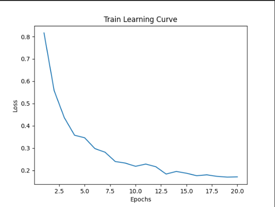

# CSC413-Project

OpenAI’s new NLP model, ChatGPT-3, has been used by many people in different fields. As it can produce responses within seconds, overflowing the internet using the responses without people noticing can be a hidden hazard. We decided to train a Transformer model to identifies AI responses in Open Communication Forms (e.g. Reddit, StackOverflow, etc) to help people to distinguish human response and AI response. The input in our model is a sequence of words in the form of a text document from human or Chatgpt, and the output is a class label indicating the sentiment of the input text which 1 is Human and 0 is Chatgpt in our case. Our project will be encoding input text using word embedding, and then processed by the RNN to capture the sequential information in the text. The final result will be a classification of 0 or 1 indicating the result. 

### Model Figure:

For this project, we are using pre-trained BERT (Bidirectional Encoder Representations from Transformers) model and fine tune it using our dataset.
The following diagram showed how BERT process the embedded word to output.

*[source](https://arxiv.org/abs/1810.04805v1)*

Since the input contains multiple sentences, after tokenized each word and concatenate the sentences together, it will be process the same way into the model.

*[source](https://arxiv.org/abs/1810.04805v1)*

### Model Parameters: 
There are in total 110M parameters according to https://huggingface.co/bert-base-uncased. Parameters are mainly came from the different layers in the RNN model. Weights are mainly from two sources, one for the input and another is from the recurrent connections.  The parameters of weights in the model come from the weights associated with the various layers in the Bidirectional Encoder representations from Transformers RNN model. These weights are learned during pre-training using a large amount of data and fine-tuned for the downstream task using a smaller amount of task-specific labeled data. Model also have bias for each layer that is weighted.

### Examples:

 - Success Prediction: 

{'text': "For individuals who want to improve their own vocabulary, there are several strategies that can be effective, including: Reading widely: Reading books, articles, and other written materials can expose you to a variety of new words and their usage in context. It's important to choose materials that are appropriate for your current level of reading comprehension and gradually work your way up to more challenging texts. Using a dictionary: When you encounter a new word, look it up in a dictionary to learn its definition and usage. This can help you remember the word and use it correctly in the future. Playing word games: Word games such as Scrabble, crossword puzzles, and word searches can be fun and effective ways to expand your vocabulary and improve your word recognition skills. Learning word roots and affixes: Many words in the English language share common roots and affixes. Learning these can help you recognize the meaning of unfamiliar words based on their prefixes, suffixes, and roots. Practicing using new words: To truly master a new word, it's important to use it in context and practice incorporating it into your own writing and speech.", 'label': 0} 

prediction: [1, 0]

 - Failed Prediction: 

{'text': "Habitat for humanity ReStore is a good place to donate stuff It's a not for profit place. Location is Dixie and just north of Eastgate. All other places like V.V and Talize all out there overpricing shit for everyone now.", 'label': 1}

prediction: [1, 0]

## Data:

For this project, since we are fine tuning our model, we only need a small set of data to train.

### Data Source: 
We are hand collecting 1000 questions and answers from Reddit, Stack Overflow and ChatGPT. 

### Data Summary: 

We collected our data from searching for questions and discussions on open communication platforms (e.g. Reddit, StackOverflow, etc). Then, ask some questions to ChatGPT-4 for AI answers. We have 1000 data points in toal. 125 of them are from Reddit questions and answers, 125 of them are from StackOverflow questions and answers, 125 of them are from Reddit questions and GPT answers, 125 of them are from StackOverflow questions and GPT answers. Refer to the proposal, we add 250 more Reddit questions and answers, 250 more Reddit questions and GPT answers. 

### Data Transformation: 
The features we collected are questions, answers, ids and labels. The ids and questions are just stored for organizing our data set and make us able to refer any answer if there is a problem. Therefore, they are not used in the model training. The answers also named as "text" in the file are the string input to our model. The labels can be either 0 or 1. 0 refers to human answers and 1 refers to AI answers. It is our output.

### Data Split:
During split, we always make sure each data set has the same number of answers in each sources. Initially, we have 6 data sets refers to Reddit, StackOverflow, Reddit_GPT, StackOverflow_GPT, additional Reddit and additional Reddit_GPT with size 125, 125, 125, 125, 250, 250, respectively. Then, we decide each of our training set and validation set take 40% of data. The rest 20% are test set. Therefore, each of our training set and validation set takes 50, 50, 50, 50, 100, 100. The rest 25, 25, 25, 25, 50, 50 belongs the test set. After splitting, we shuffle the order in each set again the make sure there is not parttern in order in each set.

## Training:

The diagram below is our training curve of our final model:

### Hyper-parameters

- Learning rate: 
We start as a bigger value with alpha 0.01 and find out it is too big that make our loss and accuracy bounce frequently in the graph. Therefore, we slowly descrease its value and find out 1e-7 provide us the best validation accuracy and learning curve.

- Epoches:
For the number of epoches to train the model, we started from 5 and 10, which the model only predicts 1 as the output. Once we increase the epoches to 20 and above, the model starts to have correct prediction.

- Weight Decay:
For the weight decay, we start with 0.01 to tune and decrease it slowly. It turns out the weights decay does not influence our model much. Therefore, we choose the 0.001 which has the best performance to avoid overfit. 

### Quantitative measures 
- Accuracy:
Our question is typical classification problems, we would use an accuracy to examine the performance of our data. Accuracy measures the proportion of correct predictions of all the predictions. In our case, we have 200 balanced test dataset and it is balanced which would 100 0s and 100 1s.

- Precision: 
In our study, there is unlikely to say in prediction that a responses is 100 percent that is produced by human or chatgpt. In our case, precision could be a quantitative measure to determine whether a text is how much percentage that is a text is human/gpt generalized.

### Quantitative and Qualitative Results
- To test the our model qualitatively, we select two small set with size 10. One of them are all human answers and the other one are all AI answers. The result shows that our model have 100% accuracy one both of the two sets. Therefore, we can conclue our model is able to clearify the labels when the test sets are biased.
    PredictionOutput(predictions=array([[ 4.6563153, -3.9140778],
       [ 4.6696877, -3.9475315],
       [ 4.6845713, -3.9484203],
       [ 4.6623883, -3.9313943],
       [ 4.6121287, -3.853777 ],
       [ 3.9521146, -3.4532526],
       [ 4.610977 , -3.860734 ],
       [ 3.8791096, -3.3897698],
       [ 4.6723375, -3.9319425],
       [ 4.580537 , -3.815881 ]], 
       dtype=float32), label_ids=array([0, 0, 0, 0, 0, 0, 0, 0, 0, 0], dtype=int64), metrics={'test_loss': 0.00028671175823546946, 'test_accuracy': 1.0, 'test_runtime': 0.1412, 'test_samples_per_second': 70.811, 'test_steps_per_second': 14.162})
{'test_loss': 0.00028671175823546946, 'test_accuracy': 1.0, 'test_runtime': 0.1412, 'test_samples_per_second': 70.811, 'test_steps_per_second': 14.162}
PredictionOutput(predictions=array([[-4.258265  ,  3.6214678 ],
       [-0.52718896,  0.34551552],
       [ 1.9680529 , -1.9258574 ],
       [ 0.75853956, -0.8793166 ],
       [-1.5136863 ,  1.265023  ],
       [-3.427043  ,  2.904456  ],
       [-2.7634    ,  2.357883  ],
       [-1.9366478 ,  1.6346732 ],
       [-3.765522  ,  3.233716  ],
       [-4.0270734 ,  3.425226  ]], 
       dtype=float32), label_ids=array([1, 1, 1, 1, 1, 1, 1, 1, 1, 1], dtype=int64), metrics={'test_loss': 0.6176283955574036, 'test_accuracy': 0.8, 'test_runtime': 0.119, 'test_samples_per_second': 84.033, 'test_steps_per_second': 16.807})
{'test_loss': 0.6176283955574036, 'test_accuracy': 0.8, 'test_runtime': 0.119, 'test_samples_per_second': 84.033, 'test_steps_per_second': 16.807}
### Justify Results:

We used test set that was part of the original dataset and measure its accuracy from our model.
There are 200 data being select from the 1000 original dataset as test set.
We obtained around 87.5% test accuracy which is reasonably reliable.

Our method preformed relatively well given our problem of identifying AI response. 

To justify our implementation, the most important thing is that to check whether the BERT- base-model from hugging face is transformedable to our human and Chatgpt response detection. As we further discovered, we could approach this task by using fine-tune the pretrained BERT model on a labeled dataset which is our human and Chatgpt response dataset. In our method, we first prepocessed our data to convert the input responses into the required format for the BERT model which tokenization. Then we fine-tune the BERT model on our tokenized data using RNN training procedure. Once the model is trained, we used validation to tune any hyperparameter that is listed above. In our test, we would give a response into the fine-tuned model to get a proablilty of the two classes. Further more, we used argmax to extract the class that is more fittable for the given response. From another point of view to justify our implement would work is that using RNN we could find our the find some fit phrases or high frequency words  that the Chatgpt would highly use compared to human responses. At the end we used a combination of quantitative and qualitative evaluation metrics to assess the effectiveness or our approach and identify the problems or bias we would have in our model.  We also conduct test set to evaluate the performance of model. If the model can preform well on our test set, it means that our model is capable and most likely to be accurate on generalize new responses from other new data which our model did. Our model captures the important patterns or key words or phrases that Chatgpt would use. 
In the data collection section, our data also fulfilled to reduce any bias that might occur of affecting test results. Our data questions cover area are all sorts of questions from different area such general, finance, medical, coding. We also reformat the Chatgpt and human response to reduce the while space or new line that would caused a bias. The reason behind it that Chatgpt always gives response in a specific paragraph-essay format. Our data cleaning highly reduce the bias for our result. 

### Ethical Consideration:

### Positive Side:

- Our model can detect whether a text is generated by AI which can be an Academic Offense in school works or other inquiries which encourage people's own creativity in their project/work.  

- Our model can promote transparency in the use of AI-generated text to prevent fraud. Individuals can use the model to identify whether a text they are reading or interaction with text that is AI- generated by AI could help build trust in the use of chat systems. 

### Negative Side: 

- Our model may provide inaccurate output based on bias which may lead to human unfair judgment or incorrect decisions. As a result, it may be an offense against certain authors who are wrongly assumed to have authored AI-generated text. 
- On the other hand, our model could raise privacy problems for people who wish to remain anonymous for their text. In addition, it could raise privacy concerns for the group who do not want their text to be identified as AI-generated. The model has ethical implications in free speech. 
- There are limitation in our training data. For the training data in our study, our data is limited with stackover flow or reddit only which is not full fill the questions or the sentences that the users would ask in Chatgpt. Other questions from other sources may affect the result of our data. In addition, in our data, the questions are more likely to be general questions instead of questions in specific area. Different types questions or different ways to implement question may also influence the result of Chatgpt products which will increase the bias in out model. 
- In our training data, there will also be a bais for the questions that violates the rules or the terms of services for Chatgpt. These questions would cause Chatgpt give highly similar error messages which will influences the result that were expected. 

## Authors

Yuxuan Mu - Collecting data from online platform and ask the questions on chatGPT. While training the model, prepare test data.

William Chau and HanchengHuang - Implement the model using Hugging Face and prepare for the fine tuning. Once the dataset is ready, tune the hyperparameters and collect the result.
